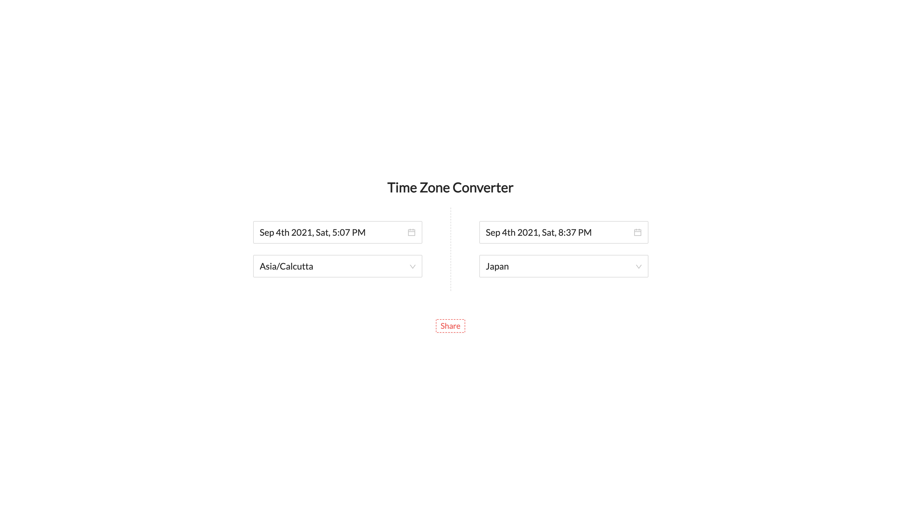
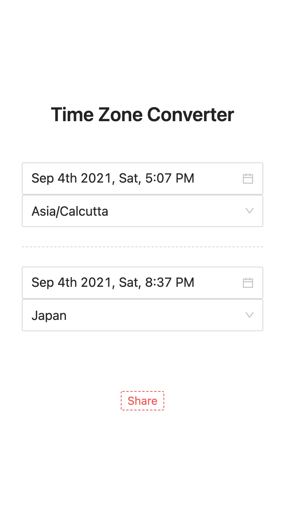

# Timezone converter

Timezone converter is a webapplication where one can convert specfic time from one time zone to other timezone.

## Screenshots

_Web view_



_Mobile view_



## Live url

[Click here](https://time-zone-converter.vercel.app)

## Local setup

To run this application in local execute the following commands

### Clone the repo

```bash
git clone https://github.com/saketh-kowtha/time-zone-converter.git
```

#### Node modules installation

```bash
npm install
```

#### Running in local

```bash
npm run dev
# Hit http://localhost:3000 from your browser.
```

## API Usage

If you are running in local then DOMAIN url is `http://localhost:3000` otherwise `https://time-zone-converter.vercel.app/`

```bash
URL: <DOMAIN>/api/time-zone-converter?ts=1630760210003&from=asia%2FBangkok&to=zulu
Method: GET
Query params:
  ts: Timestramp
  *from: Timezone
  *to: Timezone

Sample Response:
{
  "fromTz": "asia/Bangkok",
  "toTz": "zulu",
  "asia/Bangkok": "September 4th 2021, Saturday, 4:00:20 AM",
  "zulu": "September 3rd 2021, Friday, 10:30:20 PM"
}
```

### Query params

| Param | Mandatory | Description                                                                    | Example         | Default value      |
| ----- | --------- | ------------------------------------------------------------------------------ | --------------- | ------------------ |
| ts    | NO        | This is optional if it didn't passed then API will consider current time as ts | 1630760210003   | Current timestramp |
| from  | Yes       | From timezone                                                                  | Asia%2FCalcutta | -                  |
| to    | Yes       | To timezone                                                                    | Asia%2FCalcutta | -                  |

### Using with cURL

```bash
curl 'https://time-zone-converter.vercel.app/api/time-zone-converter?ts=1630760210003&from=asia%2FBangkok&to=zulu'

Output:
{"fromTz":"asia/Bangkok","toTz":"zulu","asia/Bangkok":"September 4th 2021, Saturday, 4:00:20 AM","zulu":"September 3rd 2021, Friday, 10:30:20 PM"}%
```

### Using with Fetch

```javascript
fetch("https://time-zone-converter.vercel.app/api/time-zone-converter?ts=1630760210003&from=asia%2FBangkok&to=zulu", {
  "body": null,
  "method": "GET",
})
.then(response => response.json())
.then(data => console.log(data));

// Output:
{
  fromTz: 'asia/Bangkok',
  toTz: 'zulu',
  'asia/Bangkok': 'September 4th 2021, Saturday, 4:00:20 AM',
  zulu: 'September 3rd 2021, Friday, 10:30:20 PM'
}
```

### Using with Axios

```javascript
axios.get("https://time-zone-converter.vercel.app/api/time-zone-converter?ts=1630760210003&from=asia%2FBangkok&to=zulu")
.then(response => console.log(response.data))
.catch(console.error)

// Output:
{
  fromTz: 'asia/Bangkok',
  toTz: 'zulu',
  'asia/Bangkok': 'September 4th 2021, Saturday, 4:00:20 AM',
  zulu: 'September 3rd 2021, Friday, 10:30:20 PM'
}
```
